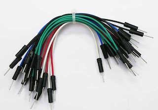
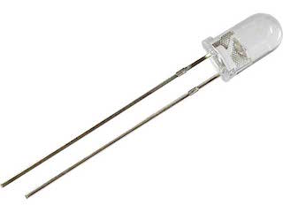
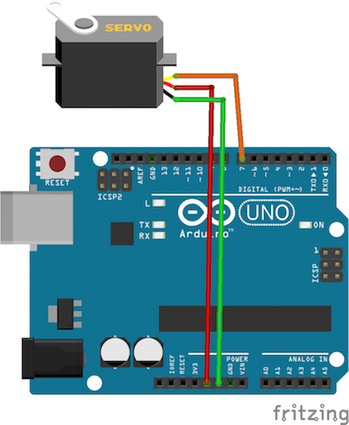

# スクラッチでピタゴラ装置を作ろう

## LICENSE

 スクラッチでピタゴラ装置を作ろう by OtOMO is licensed under a <a rel="license" href="http://creativecommons.org/licenses/by-sa/3.0/deed.ja">Creative Commons 表示 - 継承 3.0 非移植 License</a>.

## 1.概要

Scratch@MIT 2012 でおこなわれた [Pre-Conference Workshops](http://events.scratch.mit.edu/conference/workshops.html)
のうちの一つ、Physical-Digital Chain Reaction: WeDo and Scratch を、Scratch2.0とArduinoで実現する方法についてまとめています。

同様のワークショップは、日本でもすでに開催されており、そちらの内容も参考にしております。
* [OtOMO主催 「スクラッチでピタゴラスイッチマシーンを作ろう」](http://scratch-ja.org/2012/08/1815)
* [ヤスラボ主催 「スクラッチでピタゴラ装置を作る!」](https://www.youtube.com/watch?v=M5ibKrzqlUg)

今回のワークショップでは、スクラッチ2.0にArduinoをつなげ、光センサとLEDの点灯を制御して光のリレーをおこなうことで、テレビ「ピタゴラスイッチ」にでてくるような装置を参加者全員のスクラッチをつなげて作るワークショップとなります。

本ドキュメントでは、そのワークショップを実施するにあたって気をつけるべきポイントや必要なモノ、回路図や手順などを、画像や動画を使ってまとめています。

## 2. 必要なもの
### 2.1. ハードウェア
* Arduino × 1個
  - 材料例：[Arduino Uno Rev3](https://www.switch-science.com/catalog/789/)

  

* ブレッドボード × １個
  - 材料例：[ブレッドボード BB-801](http://akizukidenshi.com/catalog/g/gP-05294/)

  

* シャンパーワイヤー（オスーオス） × ５本程度
  - 材料例：[ブレッドボード・ジャンパーコード（オスーオス）セット](http://akizukidenshi.com/catalog/g/gC-05159/)

  

* 明るいLED（高輝度LED） × １個
  - 材料例：[超高輝度５ｍｍ緑色ＬＥＤ　ＯＳＧ５８Ａ５１１１Ａ](http://akizukidenshi.com/catalog/g/gI-06405/)

  

* Cdsセル（光センサ） × １個
  - 材料例：[ＣｄＳセル（１ＭΩ）ＧＬ５５２８（４個入）](http://akizukidenshi.com/catalog/g/gI-05886/)

  

* 抵抗100Ω

  

* 抵抗10kΩ

  

### 2.2. ソフトウェア
* [Scratch2.0 Offline Editor](https://scratch.mit.edu/scratch2download/)
* [Arduino IDE](http://www.arduino.cc/en/Main/Software)
* [Scratio](http://lets.makewitharduino.com/sample/scratch/index.html)

## 3. 準備
### 3.1. 光センサの回路例

上記の回路図で使用しているCdsセルが光センサです。

Cdsセル自体が、1MΩの抵抗と等価ですので、片側に５V、片側に10kΩの抵抗を繋ぐことで、分圧抵抗により明るさが計測できます。

この例では、明るさの変化をArduinoのアナログ0ピン（A0）で計測しています。

### 3.2. 明るいLEDの回路例

この例では、明るさセンサが反応しやすくなるように、高輝度LEDと低い抵抗（100Ω）を使い、LEDの制御をArduinoのデジタル11ピン（D11）で行っています。

実際には、LEDの点滅を明るさセンサが検出しやすいように、LEDを曲げたりして、明るさセンサに出来るだけ近づけるなどの工夫が必要です。

### 3.3. スクラッチ2.0 と Arduino を繋ぐ方法

詳細は、[こちら](http://lets.makewitharduino.com/sample/scratch/index.html)を参考ください。

## 4.ワークショップの手順
### 4.1. アイスブレイク（10分）

MITのワークショップでおこなわれたアイスブレイクです。

参加者全員が輪になり、手をつなぎあいます。

左手をギュッとつかまれたら、今度は右隣の人の手をギュッと握るよう全員に伝えます。

ファシリテーターがスタートとなり、右手をギュッとにぎります。

左手をつかまれたファシリテーターの右隣の人は、その右隣の人の手を握り、そのまた右隣の人の手を握る… と繰り返していくことで、つぎつぎ連鎖して、最後はファシリテーターの左手が握られ、そこでファシリテーターは左手が握られたことを伝え「ゴール」を宣言します。

これからつくるピタゴラスイッチマシーンは、同じ要領で動くことをイメージさせることができます。

### 4.2. Arduinoの接続確認

Arduino と スクラッチ を繋げ、Scratioを介してうまく接続できているかを確認する。

下記の部分が緑色に点灯していれば、接続できている。

### 4.2. 明るさセンサをつかった簡単なプロジェクト（20分）

明るさによって、オン・オフされるスイッチをスクラッチで作ってみる。

### 3.3. LED を点灯させる簡単なプロジェクト（20分）

LEDをオン・オフするスクラッチを作ってみる。

## 3.4. 上記2. 3.を組み合わせ、手をかざせば LED が点く「超能力マシーン」をつくる（20分）

時間が足りない場合は省略可能。

## 3.5. ピタゴラ装置をつくる(60分)

参加者全員の机を輪の形に並べ替える。

左隣の人のArduinoから LED を伸ばしてきて、自分の明るさセンサに接続する。

自分の LED を伸ばし、右隣の人の明るさセンサと接続する。

明るさセンサの値が高くなったら左端からボールが転がり始め、右端にボールが着いたら、LED を点灯させるプロジェクトをつくる。

プロジェクト例 明るさセンサの値が高くなると転がり出すボール

### 3.6. テスト(40分)
まずは自分のプロジェクトがちゃんと動くまでテスト。

次に左隣の人と接続してテスト。

右隣の人と接続してテスト。

最後に全体で総合テスト。

### 3.7. 本番(10分)
スタートのプロジェクトが見える位置に参加者全員移動。

つぎつぎプロジェクトが起動していくに従い移動。

できればビデオ撮影してあとでビデオを公開する。

### 3.8. 自由製作
坂道を玉が転がるプロジェクトを真似してもらい、いちどすべてがうまく動いてから自由製作に入るようにします。

最初(明るさセンサの値で左端よりボールを転がし始める)と最後(右端にボールがたどりついたらLEDを点灯させる)の部分は変更せず、その間はどんな動きをさせてもよいという条件で自由にプロジェクトを変更する。

## 4 参考
### サーボの配線
例えば、サーボモーターをD7ピンで使う場合には、下記のような配線となります。

